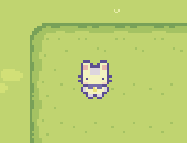
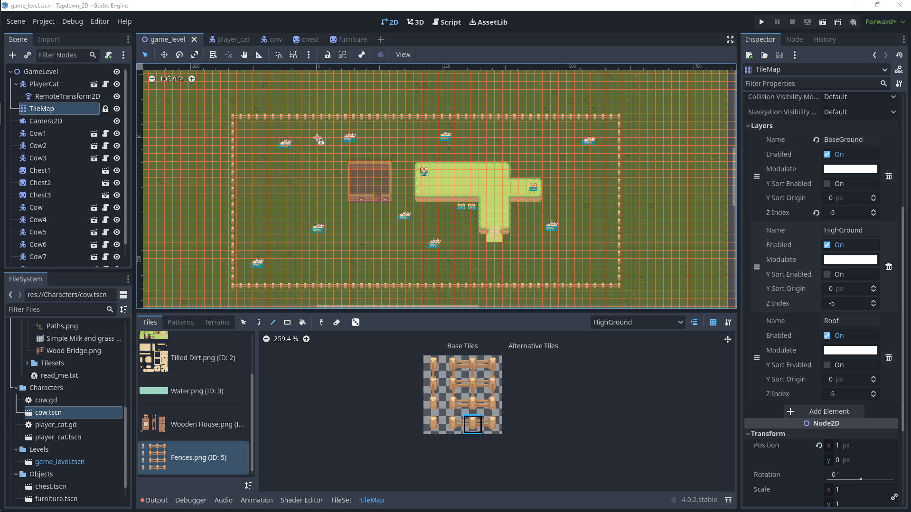
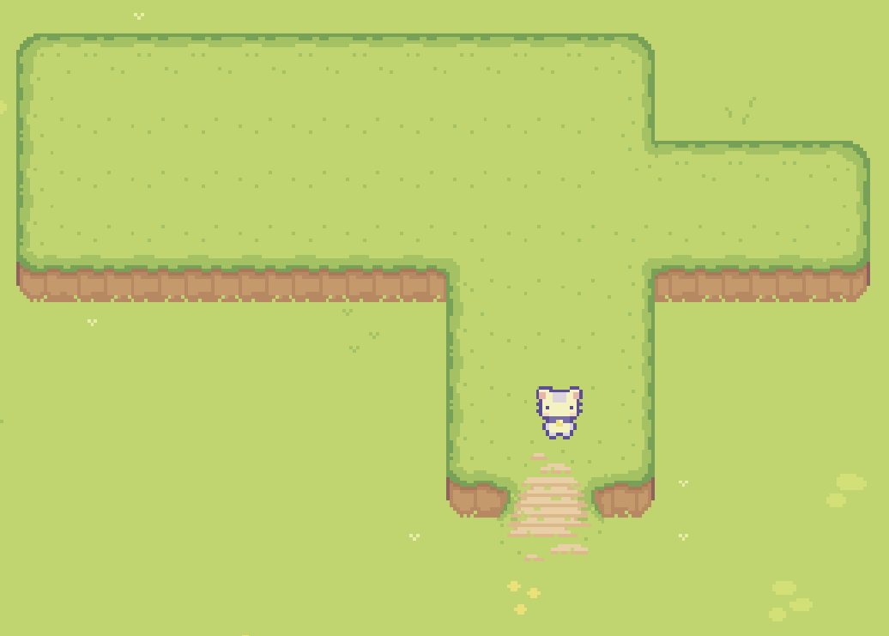

# Topdown 2D

A Godot 4 game created in half a day from [this tutorial](https://youtu.be/Luf2Kr5s3BM) using [these assets](https://www.youtube.com/redirect?event=video_description&redir_token=QUFFLUhqbWg3elNyRjFnX1Z2aWtSU3FsOUJoVEdKYWFOUXxBQ3Jtc0trVzhIZVZYeUdtaXo1VDlyRDRiMm1ELWZONWMxbDNiYnA2ekMyR01MYS1rVzRmY1RzUm43T1BZTFhTd193S2Y4eHNXWVNpZE5KZjhrRDIyNUNZdTZ5ZkZCbm9TbjVLc0tDRXBxNWFYbUdVMkdUXy1Baw&q=https%3A%2F%2Fcupnooble.itch.io%2Fsprout-lands-asset-pack&v=Luf2Kr5s3BM). Play as a little cat walking around a small collidable map.

## Playing the Game

Execute the `./Topdown_2D.exe` file.

## Media

### The player (cat)

### The editor

### Game under development

